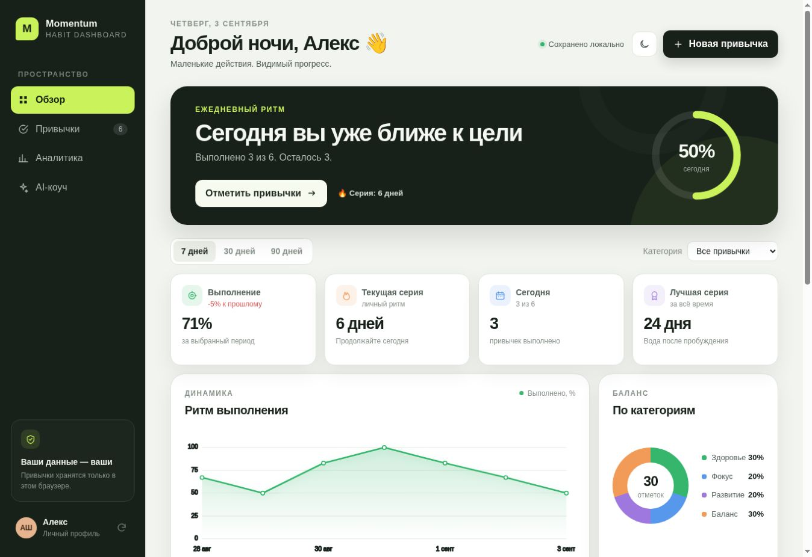
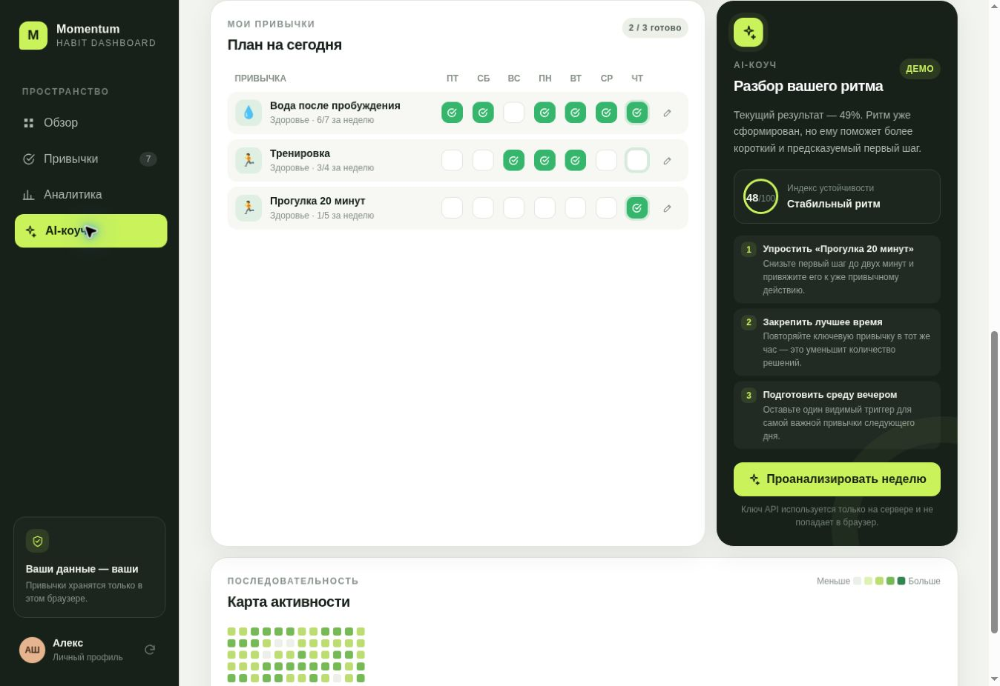

# Momentum — AI Habit Dashboard

Интерактивный dashboard для привычек: ежедневные отметки, серии, фильтры, графики, карта активности и персональный AI-разбор. Интерфейс показывает рекомендации карточками, а не сырым JSON.

Если хочется сразу запустить проект без чтения документации, откройте `START_HERE.txt`.

## Возможности

- добавление, редактирование и удаление привычек;
- отметки за последние семь дней;
- аналитика за 7, 30 и 90 дней;
- фильтр по категориям;
- общий процент, текущая и лучшая серии;
- линейный график, круговая диаграмма и heatmap;
- сохранение в `localStorage` и экспорт JSON;
- светлая и тёмная темы;
- AI-анализ через серверный OpenAI Responses API;
- автоматический demo fallback, если ключ ещё не настроен;
- адаптивный интерфейс для desktop, tablet и mobile;
- обработка загрузки, ошибок API и пустого состояния.

## Быстрый запуск

Требуется Node.js 20 или новее. Устанавливать библиотеки не нужно.

```bash
npm run dev
```

Откройте `http://127.0.0.1:4173`.

Проверка проекта:

```bash
npm run verify
```

## Скриншоты





## Подключение OpenAI

До добавления ключа приложение полностью работает в демонстрационном режиме. Для реального AI-разбора создайте рядом с `package.json` файл `.env.local`:

```env
OPENAI_API_KEY=ваш_новый_ключ
OPENAI_MODEL=gpt-5.6
```

Перезапустите `npm run dev`. Ключ читается только сервером и никогда не отправляется в браузер или `localStorage`.

Используется OpenAI Responses API со Structured Outputs. Модель возвращает объект по строгой JSON Schema, затем сервер дополнительно нормализует результат перед показом в UI.

Официальные материалы:

- https://developers.openai.com/api/docs/quickstart
- https://developers.openai.com/api/docs/guides/structured-outputs

## Архитектура

```text
Browser UI
  ├─ localStorage: привычки, отметки, настройки
  ├─ analytics.mjs: чистые расчёты показателей
  ├─ render.mjs: безопасный HTML и SVG-графики
  └─ POST /api/insights
       └─ Serverless API → OpenAI Responses API
```

Основные файлы:

- `src/store.mjs` — состояние, валидация и localStorage;
- `src/analytics.mjs` — расчёты без привязки к UI;
- `src/render.mjs` — карточки, графики и список привычек;
- `src/insights.mjs` — demo-анализ и клиент API;
- `api/insights.js` — валидация, OpenAI и безопасные ошибки;
- `server.mjs` — локальный сервер без зависимостей.

## Безопасность

- ключ API находится только в `.env.local` или переменных окружения Vercel;
- `.env.local` исключён через `.gitignore`;
- запросы ограничены по размеру и проходят серверную валидацию;
- ответ модели ограничен строгой схемой и нормализуется;
- данные пользователя не включают имя, email или другие персональные поля;
- `store: false` отключает сохранение ответа в запросе Responses API;
- пользовательский текст экранируется перед вставкой в HTML;
- сервер отправляет CSP и базовые security headers.

## Тестирование

`npm test` запускает unit- и integration-тесты на встроенном `node:test`, а `npm run smoke` — реальный локальный HTTP-сценарий:

- вычисление процентов и серий;
- фильтрация и пустые состояния;
- запись и восстановление localStorage;
- demo fallback;
- валидация API;
- Structured Outputs request;
- успешный, ошибочный и rate-limit ответы OpenAI.

Фактические результаты автоматических и браузерных сценариев записаны в `QA_REPORT.md`.

## Деплой на Vercel

1. Загрузите папку в GitHub.
2. Импортируйте репозиторий в Vercel.
3. Добавьте `OPENAI_API_KEY` и при необходимости `OPENAI_MODEL` в Environment Variables.
4. Выполните Deploy. `index.html` будет опубликован как frontend, а `api/insights.js` — как serverless function.

При публикации без ключа live demo продолжит работать с локальным анализом.

## Ограничения MVP

Данные сохраняются в одном браузере. Авторизация, облачная синхронизация и совместные профили сознательно не входят в двухдневный MVP.
